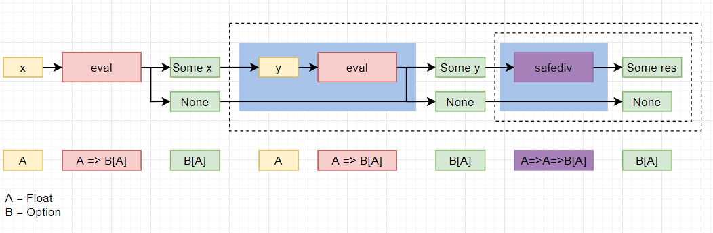
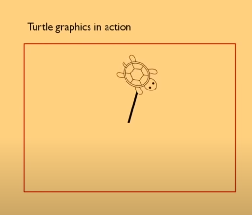
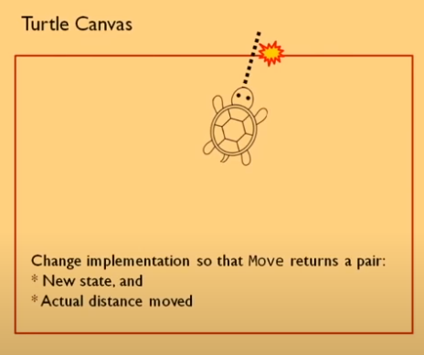
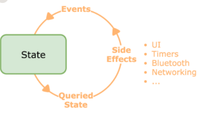
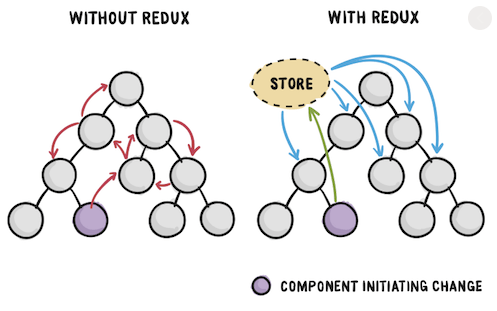

# 모나드 Monad

## TL;DR
> `자기 자신의 타입을 반환 타입으로 가지는 메소드`를 가지는 `제네릭 타입`


⚠이하 본문은 `제네릭 프로그래밍`, `대수적 자료형`, `패턴 매칭` 을 알고 있음을 전제 하에 기술되었습니다.

## 📜목차
- [📐수학적 접근으로의 모나드](#📐수학적-접근으로의-모나드)
- [💻프로그래밍적 관점의 모나드](#💻프로그래밍적-관점의-모나드)
- [Monad by Computerphile](#monad-by-computerphile)
- [Thirteen ways of looking at a turtle ~Monad~](#thirteen-ways-of-looking-at-a-turtle-monad)
---
## 📐수학적 접근으로의 모나드

## `A` Monoid `in the` Category `of` Endofunctors

- [모노이드](#모노이드-monoid-단군)
  - [반군](#semi-group-반군)
  - [대수 구조](#대수-구조-algebraic-structure)
- [카테고리](#카테고리-category-범주)
  - [사상](#사상-morphism--함수)
- [함자](#)


### 모노이드 monoid 단군
항등원을 갖는 `semi group`
> Monoid (S,F)에 대하여 a,b,c ∈ S 일때 `F(F(a,b),c)` = `F(a,F(b,c))` 이다  
> Monoid (S,F)에 대하여 x,i ∈ S 일때 `F(x,i) = x` 를 만족하는 `i` 가 존재한다

>#### semi group 반군
>결합 법칙을 따르는 이항 연산을 갖춘 `대수 구조` (S,F)  
>> SemiGroup (S,F)에 대하여 a,b,c ∈ S 일때 `F(F(a,b),c)` = `F(a,F(b,c))` 이다
>
>>#### 대수 구조 algebraic structure
>>일련의 연산들이 주어진 집합
>>대수 구조의 signature (T,arity) 는 arity:T->N  

---

## `A Monoid in the` Category `of` Endofunctors

### 카테고리 Category 범주
- 대상의 모음
- 카테고리 S에 대하여 a,b ∈ S 인 대상 a,b에 a를 정의역으로, b를 공역으로 하는 사상이 존재 
  - ❗이때의 a,b는 구체적 값이 아닌 하위 카테고리임을 주의
- 사상은 합성이 가능
- 자기 자신으로 가능 항등 사상이 있음
- 사상은 결합 법칙을 만족함

>#### 사상 morphism = 함수

---

## `A Monoid in the Category of` Endofunctors

### 함자 functor
범주론에서, 두 범주 사이의 함수에 해당하는 구조.

범주 C,D에 대하여 C와 D 사이의 함자는 F:C → D 로 표기
- C의 임의의 대상 X에 대해 대응되는 D의 사상 `F(X)`
- C의 임의의 사상 f:X→Y에 대해 대응되는 D의 사상 F(f):F(X)→F(Y)

#### 자기 함자 endofunctor
정의역과 공역이 같은 범주인 함자를 의미  
`F:C→C`

## `A Monoid in the Category of Endofunctors`
- 정의역과 공역이 같은 사상의 집합 속의 결합 법칙을 따르는 이항 연산을 가진 대수 구조


  
너무 깊다! 그래서 모나드가 뭐냐!

---
<br>
<br>

## 💻프로그래밍적 관점의 모나드
[reference1](https://overcurried.com/3%EB%B6%84%20%EB%AA%A8%EB%82%98%EB%93%9C/) 
[reference2](https://en.wikipedia.org/wiki/Monad_(functional_programming))

타입 `M`에 대해서 `pure function`과 `compose function`을 가지고 있으면 `M`은 모나드이다.

|이름|시그니쳐|설명|
|---|---|---|
|pure|`a -> M a`|아무 타입의 값 a를 모나딕 값 `M a`로 바꾸는 함수

🤔
### Monad의 Scala 구현체
[reference](https://stackoverflow.com/a/25361305)

```scala
class Monad[A](value:A) {
    def map[B](f:A=>B) = new Monad(f(value))
    def flatMap[B](f:A=>Monad[B]) = f(value)
}
```
### Fsharp에서의 Monad 구현체
[reference]()
```fsharp

```

---

## Monad for Scala Newbies
[reference](https://medium.com/@vigneshwaranr/monad-for-scala-newbies-9e8a12f2112b)

`Integer` 타입의 리스트에 대해서 짝수인 요소들의 제곱의 합만 구한다고 할때,  
`java` 에서는 다음과 같이 짤 수 있을 것이다

```java
public int sumOfSquaresOfEvenElements(List<Integer> list){
    if(list == null)
        return 0;

    int acc = 0;

    for(int elment:list)
        if(element%2==0)
            acc+=(element*element);
    
    return acc;
}
```

이 몇줄 안되는 함수가 하는 일들은 다음과 같다.  

1. 리스트가 `null`인지 체크
2. `acc` 선언 및 `0`으로 초기화
3. 리스트 반복문
4. 리스트 내의 요소가 짝수인지 검사
5. 리스트 내의 요소 제곱
6. `acc`에 덧셈
7. `acc` 반환

이 모든 동작들이 엉켜져 있다: acc가 여러 라인에 걸쳐서 상태를 유지하고 있는 모습을 보라!

🤔뭔가 문제가 있어 보이지 않는가?
이를 스칼-라로 써보도록 하자

```scala
def sumOfSquaresOfEvenElements(list:List[Int]):Int= {
    Option(list)
    .toList
    .flatten
    .filter(_%2==0)
    .map(x=>x*x)
    .sum
}
```

위의 코드를 풀이하자면 다음과 같다.
1. 주어진 list를 `Option 모나드` 로 승급했다. 
   - 만약 list가 null이 아니라면 `Some(value)` 가 될 것이고
   - list가 null이라면 `None`이 될 것이다.
>Scala에서는 null을 직접 다룰 일이 없지만, JAVA에서 scala 코드를 호출한다면 null 검사를 하는 것을 권장한다.  
>위의 함수가 scala에서만 호출된다면 Option으로 감싸는 단계는 생략할 수 있다.

2. 우리가 실질적으로 필요한 값은 `List 모나드` 이기 때문에, Some(value)=>List(value)로 변환한다. 이 때 타입 시그니쳐는 `List[List[Int]]` 이다
> ❓ 굳이 list로 감싸는 이유는 솔직히 모르겠음. null-safe를 원했다면 `Option.getOrElse(List.empty)`를 쓰는게 정신건강에 이롭다.

3. `List 모나드`에 `filter`연산을 적용한다.
4. `List 모나드`에 `map` 연산을 적용한다.
5. `List 모나드`에 sum `reduce((a:Int,b:Int)=>a+b)`을 적용한다

Option 체크를 제외한 코드는 다음과 같다.
```scala
def sumOfSquaresOfEvenElements(list:List[Int]):Int ={
    list
    .filter(_%2==0)
    .map(x=>x*x)
    .sum
}
```
✨깔끔!

위의 예제를 통해 `Option 모나드`와 `List 모나드`에 다뤘다....!  
그러나 위의 예제를 기반으로 모나드라는 개념이 크게 와닿지 않아 아래의 두 예제를 준비했다

---

## Monad by Computerphile
[reference](https://www.youtube.com/watch?v=t1e8gqXLbsU&ab_channel=Computerphile)

수학의 집합론에서 1960년대에 기원했으며 1990년대 컴퓨터 프로그래밍에서 재발견된 것.

`사실`을 기반으로 프로그래밍을 하는 새로운 관점

나눗셈 연산을 하는 프로그램을 모나드로 구현(본문에서는 하스켈을 예시로 들었으나, 최대한 scala로 재작성해봄)  
가장 기본적인 데이터를 표현하는 방법에 대한 접근

|수학|Scala|
|---|---|
|1|`1:Float`|
|6/2|`Div(6:Float,2:Float)`|
|6/(3/1)|?|

위의 테이블 중 마지막 경우와 같이 표현할 수 있는 방법  

값을 평가하는 `eval` 이라는 함수를 정의  
`eval` 은 `Expr`을 받아서 `Float` 값을 계산  
```scala
sealed trait Expr
case class Val(value:Float) extends Expr
case class Div(x:Float,y:Float) extends Expr

def eval(x:Expr):Float = {
  x match {
    case Val(x)=> x
    case Div(x,y)=> x/y  
  }
}
```

그러나 위의 프로그램의 경우,  
나누기 연산의 우측 피연산자가 0일 경우 DivZero! 에 의해 죽을 수 있기 때문에 이에 대한 에러를 대응해야 한다.

```scala
def safeDiv(x:Float,y:Float):Option[Float] =
  if(y==0)    None
  else        Some(x/y)
```
이런 개념을 기반으로 `eval function` 을 재작성하면
```scala
def eval[Expr](expr:Expr):Option[Float] = {
  expr match {
    case Val(x)=> Some[Float](x)
    case Div(x,y)=>
      eval(x) match {
        case None => None
        case Some(xValue) =>
          eval(y) match {
            case None => None
            case Some(yValue)=>Some(xValue/yValue)
          }
      }
  }
}
```

이 프로그램은 백년만년 장수할 것이고, 문제 없이 돌아갈 것이다.  
근데 쓰기 너무 복잡하고 쓸 것도 많다!!😡

근데 위의 코드에서는 반복되는 구조가 보임
```scala
...
 eval(x) match {
        case None => None
        case Some(xValue) =>
...
eval(y) match {
            case None => None
            case Some(yValue)=>
...
```
위의 두 경우 모두 `None` 이 들어온 경우, `None`을 반환하고, `Some`일 경우에 뭔가를 수행하는 것!  
이를 추상화하면 다음과 같다
```scala
❓ match
    case None => None
    case Some x => ❔ x
```
위의 코드에서 ❓는 `Option` 타입이고, ❔는 `f(x:A)=>B` 타입이다  

이 때의 시그니쳐는 다음과 같다


## Thirteen ways of looking at a turtle ~Monad~
[NDC London 2017-Scott Wlaschin](https://www.youtube.com/watch?v=AG3KuqDbmhM)



네모 안에 거북이가 있다고 치고, 이 거북이가 움직이면서 선을 그릴 것입니다. 사용될 API는 다음과 같습니다.
|API|설명|
|---|---|
|Move aDistance| 현재 위치에서 일정 거리를 움직입니다.|
|Turn anAngle|주어진 각도만큼 시계 혹은 반시계 방향으로 회전합니다|
|PenUp PenDown|펜을 들거나 내립니다. 펜이 내려가있을 때, 움직이는 거북이는 선을 그립니다.|

## Object Oriented Turtle

데이터와 동작이 묶여있습니다

```fsharp
type Turtle() =
    let mutable currentPosition = initialPosition
    let mutable currentAngle = 0.0<Degrees>
    let mutable currentPenState = initialPenState

    member this.Move(distance) =
        Logger.info (sprintf "Move %0.1f" distance)
        let startPos = currentPosition
        //calculate new position
        let endPos = calcNewPosition distance currentAngle startPos
        //draw line if needed\
        if currentPenState = Down then
            Canvas.draw startPos endPos
        //update the state
        currentPosition <-endPos

    member this.Turn(angleToTurn) = 
        Logger.info (sprintf "Turn %0.1f" angleToTurn)
        //calculate new angle
        let newAngle = (currentAngle + angleToTurn) % 360.0<Degrees>

        //update the state
        currentAngle <- newAngle

    member this.PenUp() =
        Logger.info "Pen Up"
        currentPenState <- Up

    member this.PenUp() =
        Logger.info "Pen Down"
        currentPenState <- Down
```

### 장점과 단점

|장점|단점|
|---|---|
|친숙하다|Stateful하고, 블랙박스(결과가 나오는 게 없으니 어떤 동작을 하는 지 가늠하기 어려움)이다|
||구성(composition)하기 어렵다|
||하드코딩된 의존성(아직까지는, 그러나 의존성 삽입으로 해결 가능)|
 

## Functional Turtle

데이터는 불변적이다

```fsharp
type TurtleState = {
    position: Position
    angle : float<Degrees>
    penState : PenState
}

module Turtle =
    let move distance state = ... //추상 데이터와 다르게 새 state를 반환
    let turn angleToTurn state = ... //추상 데이터와 다르게 새 state를 반환
    let penUp state = ... //추상 데이터와 다르게 새 state를 반환
    let penDown log state = ... //추상 데이터와 다르게 새 state를 반환
```

사용례
```fsharp
let drawTriangle()=
    Turtle.initialTurtleState
    |>Turtle.move 50.0
    |>Turtle.turn 120.0<Degrees>
    ...
```

### 장점과 단점

|장점|단점|
|---|---|
|불변성: 원인 파악이 쉽다. 블랙박스가 없다|클라이언트는 항상 상태를 추적해야 한다
|상태가 없다: 테스트 하기 쉽다|하드코딩된 의존성(아직까지는)
|함수들은 구성이 쉽다||


## State monad

화면 뒤의 스레딩 상태



만약 거북이가 네모의 가장자리에 닿으면 더 이상 가지 못한다고 하는 상황을 위하여 API를 바꿔보겠습니다.  
move의 반환값이 `(새 상태*실제 이동한 거리)`

다음은 함수형의 접근으로 새 API를 작성한 것입니다.
```fsharp
let s0 = Turtle.initialTurtleState
let (actualDistA,s1) = Turtle.move 80.0 s0
if actualDistA < 80.0 then
    printfn "first move failed -- turning"
    let s2 = Turtle.turn 120.0<Degrees> s1
    let (actualDistB,s3) = Turtle.move 80.0 s2
    ...
else
    printfn "first move succeeded"
    let (acutalDistC,s2) = Turtle.move 80.0 s1
    ...
```

위와 같이 분기를 따라 상태를 전달하는 것은 끔찍합니다. 반환값이 단순 상태가 아닌 pair이기 때문에 파이핑 또한 사용할 수 없습니다. 이런 상황이 있을 때 상태를 어떻게 계속 추적할 수 있을까요?

그래서 우리는 Turtle function을 수정해야 합니다.

기존의 Turtle function이  

>TurtleFunction(TurtleState input) -> (newTurtleState * Output)

의 형태였다면, 이를 

>f(input g(TurtleState)) -> (newTurtleState * Output)

의 형태로 `currying`를 합니다. 이를 추상화한다면 

>TurtleFunction(input) -> State<>

로 볼 수 있습니다. 이제 하나의 값을 반환하는 함수가 되었으니, 파이핑을 할 수 있습니다. 이를 사용하기 위해서는 별도의 특별한 `state expression`을 사용해야 합니다.

사용례

```fsharp
let stateExpression = state {
    let! distA = move 80.0
    if distA < 80.0 then
        printfn "first move failed --turning"
        do! turn 120.0<Degrees>
        ...
    else
        printfn "first move succeeded"
        let! distB = move 80.0
        ...
}
```

### 장점과 단점

장점

- 명령형 코드처럼 보이지만 불변성을 보전합니다.
- 함수들이 여전히 구성 가능합니다

단점

- 구현하고 사용하기 어렵습니다.

## Error handling

벽에 충돌하는 결과를 상정할 때, Turtle Function은 다음과 같이 정의할 수 있습니다.

> TurtleFunction(input TurtleState) -> (Success or Failure)

반환 값은 두 종류가 아닌 둘 중 하나이므로 이를 `Choice type` 로 표현하면 다음과 같습니다.

```fsharp
type Result<'successInfo,'errorInfo> =
    | Success of `successInfo
    | Failure of `errorInfo
```

이런 `Choice type`은 `Sum type`,`Descriminated Union type` 등으로 불리기도 합니다.

### Result를 이용한 구현

```fsharp
let move distanceRequested state =
    //calculate new position
    //draw line if needed
    if actualDistanceMoved <> distanceRequested then
        Failure "Moved out of bounds"
    else
        Success (state with poisition = endPosition)
```

이러한 다른 두 종류의 선택을 반환하는 것은 객체지향에서 쉽지 않습니다.

사용례

```fsharp
let s0 = Turtle.initialTurtleState
let result1 = s0 |> Turtle.move 80.0
match result1 with
| Success s1 ->
    let result2 = s1 |> Turtle.move 80.0
    match result2 with 
    | Success s2 ->
        ...
    | Failure msg ->
        printfn "second move failed %s" msg
| Failure msg ->
    printfn "second move failed %s" msg
```

이러한 구조를 반복하는 것은 아름답지 않습니다. 그래서 이를 result 계산식을 이용하여 재정의를 하면 다음과 같습니다.

```fsharp
let finalResult = result {
    let s0= Turtle.initialTurtleState
    let! s1 = s0 |> Turtle.move 80.0
    printfn "first move succeeded"
    let! s2 = s1 |> Turtle.move 30.0
    printfn "second movesucceeded"
    let! s3 = s2 |> Turtle.turn 120.0<Degrees>
    let! s4 = s3 |> Turtle.move 80.0
    printfn "third move succeeded"
    return()
}
```
위의 코드 중 하나라도 실패하는 것이 있다면, 다른 모든 라인을 무시하고 맨 아래의 라인으로 가게 될 것입니다. 위의 코드에서 상태를 계속 추적하는 것이 보입니다. 이를 상태와 결과를 합쳐서 표현하면 다음과 같습니다.

```fsharp
let finalResult = resultState{
    do! Turtle.move 80.0
    printfn "first move succeeded"
    do! Turtle.move 30.0
    printfn "second move succeeded"
    do! Turtle.turn 120.0<Degrees>
    do! Turtle.move 80.0
    printfn "third move succeeded"
    return ()
}
```

이는 객체지향에서의 명령형 코드처럼 보입니다. 그러나 객체지향과는 다르게 상태 관리와 에러 처리가 적용되어 있습니다.

### 장점과 단점

장점

- 에러가 명시적으로 반환됩니다(Exception이 없습니다)
- 지저분한 에러 처리 코드가 없습니다(try-catch등)

단점

- 구현하고 쓰기가 좀 어렵습니다

### 여담

여기서 사용된 `State monad` 는 많은 곳에서 사용됩니다.
- 디자인 패턴의 옵저버 패턴
- ReactiveX  

- VueX, Redux  

- Flutter의 Bloc