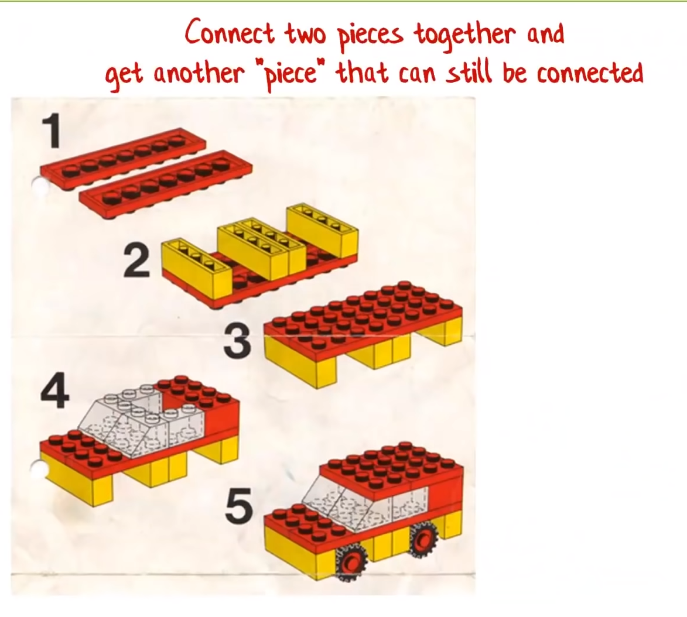

# The Power of Composition
[reference: the power of composition, NDC 2020, Scott Wlaschin](https://www.youtube.com/watch?v=rCKPgu4DvcE&ab_channel=NDCConferences)

## 합성을 알기 전에 사전 요구사항
- 어린 시절에 레고를 가지고 놀아 본 적이 있을 것
- 혹은 장난감 기차를 가지고 놀아 본 적이 있을 것

## 레고의 철학
1. 모든 부품들은 합체하기 위해 설계됨
2. 부품들은 많은 상황에서 재사용 될 수 있음
3. 두 부품이 합쳐지면 추가로 합칠 수 있는 새 부품이 생김


각각의 레고 블럭간에는 어떠한 제약 사항도 없기 때문에 온전히 재사용이 가능하다.  
프로그래밍의 관점에서는 온전히 재사용 가능한 프로그램을 만드는 것을 지향해야 함  
이런 맥락에서 method(class 등에서의)는 상당히 어울리지 않는 요소  



레고에서 작은 부품들로 큰 부품을 만드는 예시. 두 조각을 합지고 나서 계속 합칠 수 있다.

```fsharp
🍏 -> 🍌 //인 함수 A와
🍌 -> 🍅 //인 함수 B가 있을 때

//A 와 B를 합쳐서
🍏 -> 🍅 //인 함수 C를 만들 수 있다
//ㄴ 여기서 아무도 바나나의 존재를 알 수도 없고, 관심가질 필요도 없다
```
위와 같이 함수를 배치하여 새 함수를 만드는 과정이 `함수 합성`이다. 
```scala
//scala에서는 일반적으로 함수 합성을 A(B(x)) 와 같은 형태로 사용하지만, 
//다음의 구현체를 이용해서 fsharp 스타일의 파이핑을 사용할 수 있다.
//reference : https://www.reddit.com/r/scala/comments/480nfm/operator_in_scala

// approach 1
implicit class AnyEx[T](val v: T) extends AnyVal {
    def |>[U](f: T ⇒ U): U = f(v)
}

// approach 2
implicit class AnyEx[+A, -B](f: B=>A) {
    def |>:(b: B): A = f(b)
    def |>:[C](g: C => B): C => A = (c: C) => f(g(c))
}
```

함수 합성을 위한 파이프 연산자를 지원하는 언어 목록
- f#, OCaml
- Elm
- Elixir
- Scala(위에 있는 저거로 가능)
- Javascript(stage 1: experimental feature)
- R
- Haskell
- Python(Coconut, Toolz와 같은 패키지를 통해 지원)
- C#(.Pipe method extension을 통해 사용 가능)

## 타입은 클래스가 아니다

클래스는 상태`field`와 동작`method`를 포함하고 있으며, 엄밀히 말하면 타입은 여기서의 상태만을 취하는 것.(물론 변하지 않는 값이기에 상태보다는 상수형 값에 가깝다)

함수는 타입 외부에, 같은/다른 모듈`module` 안에서 관리된다


## 다른 개수의 인자를 받는 함수간의 합성

모든 함수들이 `input -> function A -> output` 형태로 되어있다면 이상적이나,  
`input1, input2 -> function B -> output` 인 경우도 있다

>함수 합성 패턴은 하나의 인자를 받을 때만 사용할 수 있다!!  
>그렇다면 모든 함수를 하나의 인자만 받는 함수로 바꾸자!  
### 커링을 이용한 합성

함수형 프로그래밍에서 커링`currying`이란  
`input1, input2 -> function B -> output` 형태의 B에 대해서

`input1 -> curried function -> (input2 -> intermediate function -> output)`
의 형태로 바꾸는 것


위의 그림에서 curried function의 반환타입은 `input2를 입력받아 output을 반환하는 함수` 이다  

```fsharp
    let add x y = x + y 
    let multiply x y = x * y
    [<EntryPoint>]
    let main argv = 
        5
        |> add 2
        |> multiply 3
        |> printfn "%d"
        0
```
fsharp은 기본적으로 일반 함수들을 커링된 형태로 변환함  
위의 `add` function의 시그니쳐 자체가 `int -> int -> int` 로 정의됨
```scala
object main {
  implicit class AnyEx[T](val v: T) extends AnyVal {
    def |>[U](f: T ⇒ U): U = f(v)
  }
  def main(args:Array[String]):Unit ={
    def add_currying(x:Int) =(y:Int)=> x+y
    def multiply_currying(x:Int) = (y:Int)=> x*y
    val res = 5|>
              add_currying(2)|>
              multiply_currying(3)

    // 혹은 multiply_currying(3)(add_currying(2)(5))
    println(res)
    //스칼라에서는 파라미터22개까지의 함수만 커링을 지원
  }
}
```

이 `currying`이란 이름은 `Haskell B. Currying`이란 수학자의 이름에서 나온 것

### 다른 개수의 반환값을 가지는 함수간의 합성