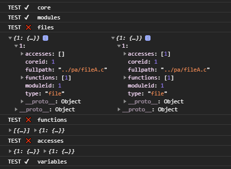

# 함수형 프로그래밍 실제 사용 사례#1

`leo report` 에서의 데이터 파서 적용 사례  
A json 을 B 로 변경해야 하는 로직
A json
```json
{
  "modules": [
    {
      "properties": {
        "id":1
        ...
      }
    }
  ],
  "files":[...],
  "functions":[...]
  ...
}
```
B 
```javascript
modules= {
  "1": {
    ...
  }
},
files={...},
functions={...}
...
```

각 개별 오브젝트별로 변환하는 함수를 작성
```javascript
let rawModules = data.modules
let rawFiles = data.files
let rawFunctions = data.functions
let rawAccesses = data.accesses
let rawVariables = data.variables

this.cores = this.genCores(rawModules)
this.modules = this.genModules(rawModules, rawFiles)
this.variables = this.genVariables(rawVariables, rawFiles)
this.accesses = this.genAccesses(rawAccesses, rawFiles, rawFunctions)
this.files = this.genFiles(rawFiles, rawFunctions, rawAccesses)
this.functions = this.genFunctions(rawFunctions, rawVariables)
```

변환 전/후의 `javascript` 오브젝트 비교 함수 (순수함수)
```javascript
 let object_equals = (x, y) => {
  if (x === y) return true
  if (!(x instanceof Object) || !(y instanceof Object)) return false
  if (x.constructor !== y.constructor) return false
  for (var p in x) {
    if (!x.hasOwnProperty(p)) continue
    if (!y.hasOwnProperty(p)) return false
    if (x[p] == y[p]) continue
    if (typeof x[p] !== 'object') return false
    if (!object_equals(x[p], y[p])) return false
  }
  for (p in y) if (y.hasOwnProperty(p) && !x.hasOwnProperty(p)) return false
  return true
}
```
테스트를 적용한 테스트 함수
```javascript
let testAction = (name, x, y) => {
  let result = object_equals(x, y)
  console.log(`TEST ${result ? '✔' : '❌'}\t ${name}`)
  if (!result) console.log(x, y)
}
```
테스트 코드 적용 결과  
